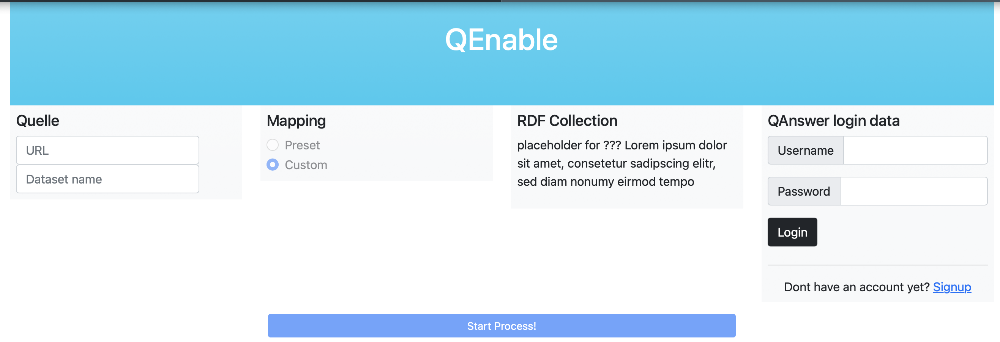
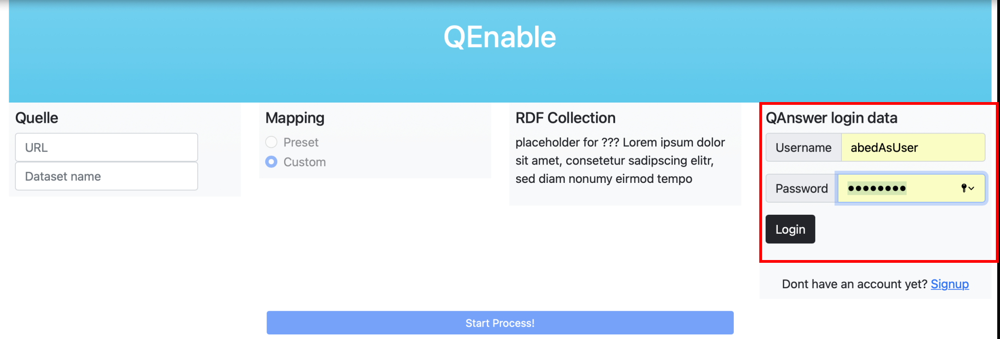
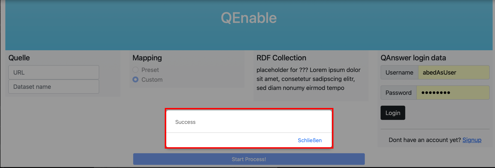
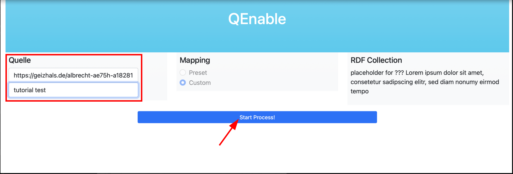
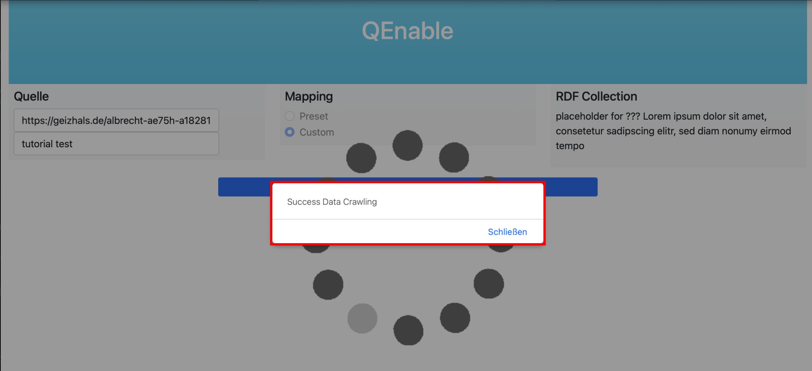
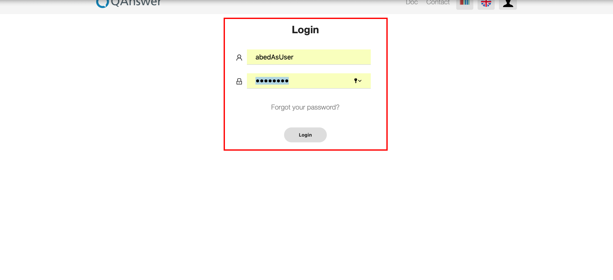
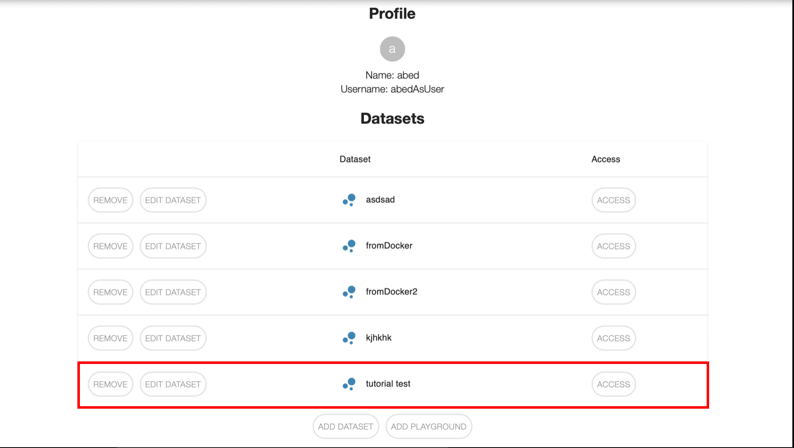

# Tutorial

## Docker

### 3.3.1 Quick-Start-Guide

    sudo docker build -t flask-image .
    sudo docker run --rm -p 5000:5000 flask-image

Weiter geht´s [hier](#ip).

### 3.3.2 Ausführliches Tutorial

Überprüfe, ob die Gruppe "docker" bereits existiert.

    groups 
    
Sollte die Gruppe nicht exitieren, muss diese erstellt werden.

    sudo groupadd docker

Der Nutzer muss der Gruppe "docker" hinzugefügt werden.

    usermod -aG docker $USER

Dockerstart:

    systemctl start docker

Es muss nun zu dem Verzeichnis des Dockerfiles navigiert und das Docker-Image gebaut werden.

    docker build -t <docker image name> .

Dabei muss `<docker image name>` mit einem Namen für das Docker-Image ersetzt werden. 

Der nächste Schritt ist die Ausführung des Docker-Images.

    docker run --rm -p 5000:5000 <docker image name>

`--rm`: Der Docker-Container wird nach dem Verlassen gelöscht, um Platz zu sparen.

`-p`: Gibt die Spezifikation des Ports an.

Die Webseite ist nun unter `http://172.17.0.2:5000` erreichbar.

Optional, wenn man einen Container bauen möchte: 

    docker container create flask-image
    docker container list -a 
    docker start <docker container id>
    docker exec -it <docker container id> /bin/bash

Dabei muss `<docker container id>` mit der ID des Docker-Containers ersetzt werden. 

## Bedienung Webseite

> Nachdem Sie sich auf unserer Webseite befinden, müssen Sie sich rechts in ihrer Instanz von QAnswer einloggen (Nutzername Passwort)
> Falls Account nicht vorhanden, schlägt Login fehl.

> Nach dem erfolgreichen Login, verschwindet das „login-Panel“ .
> Nun können Sie einen Link im Rechten Fenster „Quelle“ eingeben und mit einem Namen für das Dataset in QAnswer versehen.
> Ein anschließendes betätigen des „start process!“ Buttons, wird der Crawl Vorgang gestartet und die gecrawlt rdf´s direkt an die eingeloggte Instanz von QAnswer übergeben.

> QA-Instasnz aufrufbar unter https://qanswer-frontend.univ-st-etienne.fr/

> Nun können (abhängig von der Strukturierung des RDF) in der QA Instanz fragen auf die Webseiten beantwortet werden.
